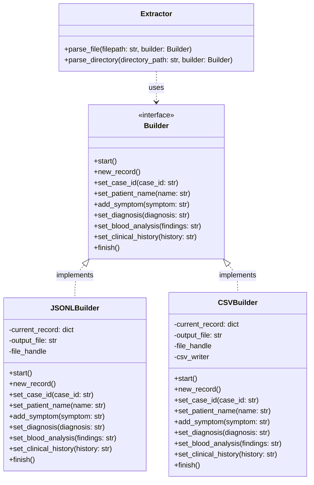

# Prompt 1

I'm working on a Python project for my NLP classes where I need to extract data from clinical reports of zombies in a structured format. There are clinical reports attached in markdown to serve as example. The main informations I need to have structured are:

- Specific symptoms and diseases
- Associate symptoms with diseases
- Analyze symptoms common or specific to certain diseases

Present me file formats that I could use to store these structured informations and the pros and cons so I better choose one or more.

Dont show me any code yet, let's first focus on design structure and file format.

# Response 1

## Recommended Data Representation Structure

To effectively model zombie clinical reports, your data layout should separate the raw extraction layer from the relational/analytical layer:

* **Entities:** Case ID, Patient Name, Symptoms (e.g., *yellow tongue*, *shaking pinky finger*), Laboratory Findings, and Diagnoses (e.g., *bite deficit*, *viral infection*).
* **Relationships:** Direct mappings connecting Patient $\rightarrow$ Symptoms, Patient $\rightarrow$ Diagnosis, and derived associations connecting Diagnosis $\rightarrow$ Symptoms.
* **Analytics:** Frequency metrics, co-occurrence counts, and disease-specificity scores.

---

## File Format Comparison

| Format | Pros | Cons | Best Used For |
| --- | --- | --- | --- |
| **JSON / JSON Lines (JSONL)** | Native support for nested, hierarchical structures; handles variable fields gracefully; ideal for streaming text. | Queries across all documents require full scans unless indexed; data duplication across records. | Storing raw extracted entities per report document. |
| **SQLite (Relational Database)** | Structured SQL queries make association analysis and symptom filtering effortless; enforced relationships. | Demands upfront schema definition; slightly higher setup overhead for small datasets. | Complex relational querying between symptoms, cases, and diagnoses. |
| **Tabular (CSV / Parquet)** | Instant loading into Pandas or Polars DataFrames; Parquet offers fast columnar compression for statistical analysis. | Multi-valued fields (e.g., lists of symptoms) require flat normalization across separate tables. | Aggregated reporting and statistical matrix analysis. |
| **Graph Formats (GraphML / JSON-LD)** | Directly maps nodes (*Disease*, *Symptom*, *Patient*) and edges (*EXHIBITS*, *DIAGNOSED_WITH*); intuitive overlap analysis. | Verbose; requires graph-specific libraries or databases (e.g., NetworkX, Neo4j). | Visualizing complex entity networks and path analyses. |

---

## Strategic Recommendation

For an NLP project, a **two-tier file format approach** works best:

* **JSONL** for the primary extraction phase, storing one structured record per clinical report.
* **SQLite** or **Parquet/Pandas DataFrames** downstream, transforming the JSON data into normalized tables to run statistical queries (such as calculating symptom frequency per disease).

Which specific downstream task or analysis do you plan to run on these symptom-disease mappings once they are extracted?

# Prompt 2

I like the idea of using two formats, but lets use JSONL and CSV for now since I know more about CSV than SQLite or Parquet. 

Now lets focus on the Python structure, like classes and methods. I'm thinking in something like this:

- Extract class with methods to parse only a file and one to parse a whole dir

- Builder interface with methods start to start building, record to record a new patient, patient_id, name, symptom, diagnosis, blood analysis, previous diagnosis and finish to finish building

- JSONL Builder and CSV Builder are classes that implement Builder interface

Dont focus on code here, just the POO structure like names, methods and consistency

# Response 2

## OOP Architecture Design

Using JSONL and CSV is a solid, practical choice. Your proposed structure closely mirrors the **Builder Design Pattern**, where a "Director" (your Extractor) dictates the data flow to a "Builder" that handles the format-specific assembly and storage.

## The Extractor Class

This class acts as the orchestrator. It reads the markdown text, applies your NLP logic, and feeds the extracted entities to the Builder.

* **`parse_file(filepath, builder)`:** Reads a single markdown file, processes the text, and sequentially calls the builder's data-setting methods.
* **`parse_directory(directory_path, builder)`:** Iterates through a target folder, invoking `parse_file` for each valid clinical report.

## The Builder Interface

This interface defines the strict contract that your concrete formatting classes must follow, ensuring consistency regardless of the output type.

* **`start()`:** Initializes the output process, such as opening file streams or writing CSV headers.
* **`new_record()`:** Signals the start of a new patient report, prompting the builder to write the previous record to disk and clear its internal state.
* **`set_case_id(case_id)`:** Records the specific case identifier.
* **`set_patient_name(name)`:** Records the patient's full name.
* **`add_symptom(symptom)`:** It is best to use an `add` method rather than a standard setter. Patients frequently present with multiple concurrent symptoms (such as a missing limb, a yellow tongue, and a shaking pinky finger), so the builder must be able to accumulate a list of them.

* **`set_diagnosis(diagnosis)`:** Records the final medical assessment.
* **`set_blood_analysis(findings)`:** Records the laboratory results.
* **`set_clinical_history(history)`:** Records previous medical context or infections.
* **`finish()`:** Flushes the very last record to the output and safely closes any open file handles.

## Concrete Builder Implementations

These classes inherit from the interface and manage how the in-memory state is structured before being written to disk.

* **`JSONLBuilder`:** Stores the incoming fields into a standard dictionary. When `new_record()` or `finish()` is triggered, it dumps the dictionary as a JSON string and writes it as a new line in the file.
* **`CSVBuilder`:** Stores fields in a flat structure. To maintain consistency within a tabular format, this builder will need a specific strategy to handle the multiple items collected by `add_symptom` (e.g., joining the list of symptoms into a single string separated by semicolons or pipes).

How do you plan to execute the actual NLP text extraction within your Extractor class (e.g., relying on regular expressions, rule-based matching, or a dedicated NLP library like spaCy)?

# Prompt 3

I like the suggestions you made. Implement them for me, still without focusing on code, in order to produce me two files:

- Mermaid file with the UML diagram of classes and methods
- Markdown file for documenting the architecture

# Response 3

## 1. Overview
This document outlines the Object-Oriented Programming (OOP) architecture for extracting structured data from zombie clinical reports. The design employs the **Builder Design Pattern**, effectively decoupling the text extraction logic (the "Director") from the data formatting and serialization logic (the "Builders"). 

This separation of concerns ensures that the NLP text analysis processes remain entirely agnostic to the target output format, allowing for high extensibility and maintainability.

## 2. Component Design

### 2.1 The Extractor (Director)
The `Extractor` acts as the orchestrator of the process. Its sole responsibility is to ingest Markdown clinical reports, apply Natural Language Processing (NLP) techniques to identify key entities, and instruct a configured `Builder` to assemble the output.

**Key Methods:**
*   `parse_file(filepath, builder)`: Opens a single Markdown file, extracts all relevant fields (Case ID, Patient Name, Symptoms, etc.), and systematically feeds them to the provided `builder` instance via its setter methods.
*   `parse_directory(directory_path, builder)`: Iterates through a given folder, orchestrating the `parse_file` method over multiple documents.

### 2.2 The Builder Interface
The `Builder` is an abstract interface that defines a strict contract. Any concrete builder must implement these methods to guarantee that the `Extractor` can reliably pass data regardless of the final file format.

**Key Methods:**
*   `start()`: Prepares the builder for a new extraction job (e.g., opening file handles, writing CSV headers).
*   `new_record()`: Flushes the currently built record to disk and resets the internal state to accept data for the next patient.
*   *Field Setters*: `set_case_id()`, `set_patient_name()`, `set_diagnosis()`, `set_blood_analysis()`, `set_clinical_history()`.
*   `add_symptom()`: A specialized accumulator method that appends a single symptom to a running list, accommodating patients with multiple overlapping symptoms.
*   `finish()`: Compleents the build process, finalizing the last record and safely closing file streams.

### 2.3 Concrete Builders

#### JSONLBuilder
The `JSONLBuilder` constructs records as hierarchical dictionaries in memory. 
*   **State Management:** Holds a single `current_record` dictionary.
*   **Symptom Handling:** `add_symptom()` appends values directly to a list under the `"symptoms"` key.
*   **Serialization:** When `new_record()` or `finish()` is invoked, the dictionary is serialized into a JSON string and appended as a new line in the target `.jsonl` file.

#### CSVBuilder
The `CSVBuilder` constructs flat, tabular records.
*   **State Management:** Holds a `current_record` dictionary matched against predefined tabular column headers.
*   **Symptom Handling:** Since CSV does not natively support nested lists, `add_symptom()` appends to an internal list which is then joined into a single delimited string (e.g., separated by a pipe `|` or semicolon `;`) right before writing the row.
*   **Serialization:** Utilizes standard CSV writing mechanisms to append rows to the target `.csv` file upon `new_record()` and `finish()`.

## 3. Data Flow Execution

1.  **Initialization:** The client instantiates an `Extractor` and a specific concrete Builder (e.g., `CSVBuilder`).
2.  **Start Build Process:** The client invokes `builder.start()`.
3.  **Parsing:** The client calls `extractor.parse_directory(path, builder)`.
4.  **Iteration:** For each file:
    *   The `Extractor` reads the file.
    *   The `Extractor` calls `builder.set_case_id(...)`, `builder.add_symptom(...)`, etc.
    *   Once a file is fully parsed, the `Extractor` calls `builder.new_record()` to finalize that patient.
5.  **Completion:** Once all files are parsed, the client calls `builder.finish()` to close out the operation.

## 4. Advantages of this Architecture
*   **Scalability:** If a requirement arises to export data to SQLite, Parquet, or XML in the future, you only need to create a new `SQLiteBuilder` without touching a single line of the complex NLP extraction code.
*   **Testability:** You can easily implement a `MockBuilder` that simply stores data in memory to unit-test the NLP extraction accuracy.
*   **Consistency:** The `Builder` interface enforces a strict protocol, guaranteeing that no matter how complex the downstream storage gets, the data schema stays uniform.

